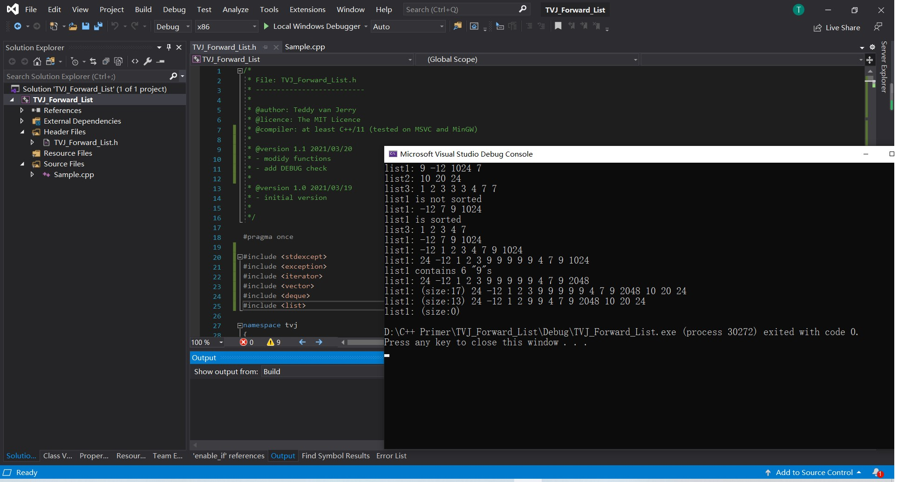
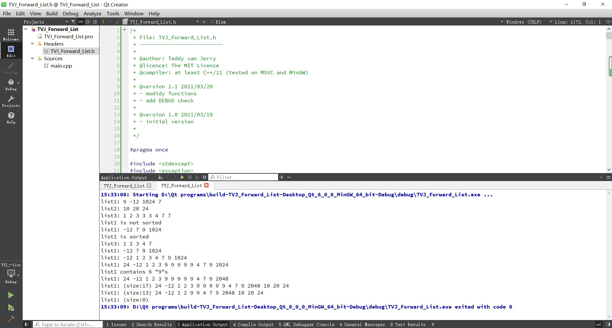

# TVJ_Forward_List
This provides a forward_list class that supports functions similar to the STL one.

## Compiler Requirement
At least C++/11 standard.

> It has been tested on MSVC and MinGW.
> * MSVC
> 
> * MinGW
> 

## Main Features
### Functions
- The `tvj::forward_list` supports many functions similar to `std::forward_list` and many others, such as `push_back`, `push_front`, `pop_back`, `pop_front`, `insert_after`, `erase_after`, `remove_at`, `find`, `search`, `sort`, `clear` and so on.
- For more information about these functions, you can find them in the header file itself.

### Iterator
It supports `iterator` and `const_iterator`, which have basic operators `*`, `->`, `+`, `++`, `+=`, `==`, `!=`.

### Debug Check
It can throw exceptions when illegal operations occur.

## Class Structure Description
The `tvj::forward_list` has `head` node (the one before the first element, accessible by iterator `before_begin`), `tail` node (the one past the end of the list, accessible by iterator `end`). The first element has iterators `begin` and `front` while the last element has iterator `back`. (Their `const` version has been ommitted.)

The list is connected together by the pointer `succ` in each node. `tail->succ` is `nullptr`. The value is stores in its member `data`.

> **Caution:** the `data` of `head` and `end` is undefined!

## Note
You can use the namespace declaration:
```cpp
using namespace tvj;
```
However, if you also `include` the STL forward list, you need to use `tvj::` to specify.